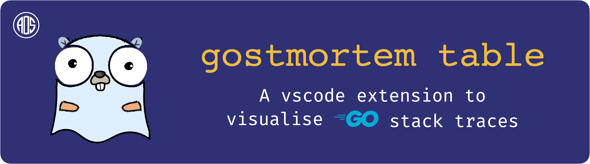

| Install Directly on | |
|---|---|
| [Visual Studio Code](vscode:extension/AOS.gostmortem-table) | [VSCodium](vscodium:extension/AOS.gostmortem-table) |

| Download from Marketplace |  |
|---|---|
| [Visual Studio Code](https://marketplace.visualstudio.com/items?itemName=AOS.gostmortem-table) | [Open VSX Registry](https://open-vsx.org/extension/AOS/gostmortem-table) |

Gostmortem table is an extension that allows you to visualize go stack traces.

The parser component [gostackparser.ts](src/gostackparser.ts) is based on  [gostackparse](https://github.com/DataDog/gostackparse) which parses a stack and provides a json object. 

## Usage

1. Paste any valid go stack trace
2. Invoke the extension using the shortcut to show all commands `cmd + shift + p` or `ctrl + shift + p`
3. select/search Visualize Stack Trace
4. The visualization table will open up

Any feedback is welcome.

> PS: I'm new to typescript and frontend development in general. I've built this extension using my limited knowledge of html, css and ts that I was able to learn in a week. Please do not hesitate to point out any issues in terms of code quality as it also helps me learn.